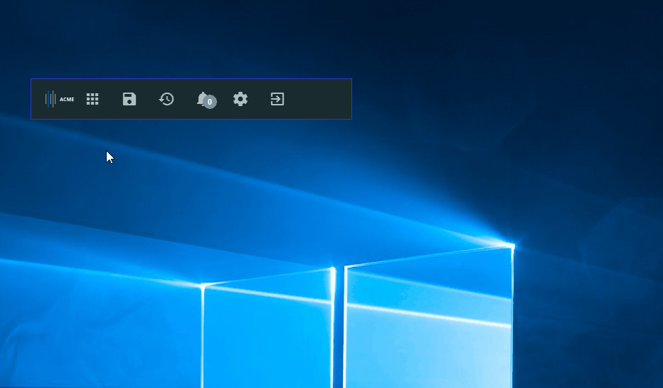

# Glue42 Desktop Toolbar Demo

The Toolbar in Glue42 Desktop is an application hub and an entry point, which allows the user to start other apps, save or load workspaces, change themes, manage notifications and settings. The Glue42 Desktop Demo Toolbar is a web application that can be modified or entirely replaced by a custom implementation. You can see the current version here:




# How to replace the built-in Glue42 Desktop Toolbar

0. Stop Glue42 Desktop, if running.

1. Open `%LocalAppData%\Tick42\GlueDesktop\config` and edit the configuration in the `system.json` file:

    * Set/add the `useEmbeddedShell` top level property to false:
    
```json
{
    ...
    "useEmbeddedShell": false
}
```

2. Host this application somewhere (e.g., a local `HTTP` server). The application is written in **Angular 1**, so no build process is required.

3. Edit the `toolbar.json` configuration (in the same folder), setting `ENTER_URL_HERE` to the `URL` where you hosted the app (step 2) . Optionally, you can add an icon `URL` and replace `ENTER_ICON_URL_HERE`.

4. Copy the Toolbar application definition that you have just edited to the `%LocalAppData%\Tick42\UserData\T42-DEMO\apps` folder.

5. Start Glue42 Desktop.